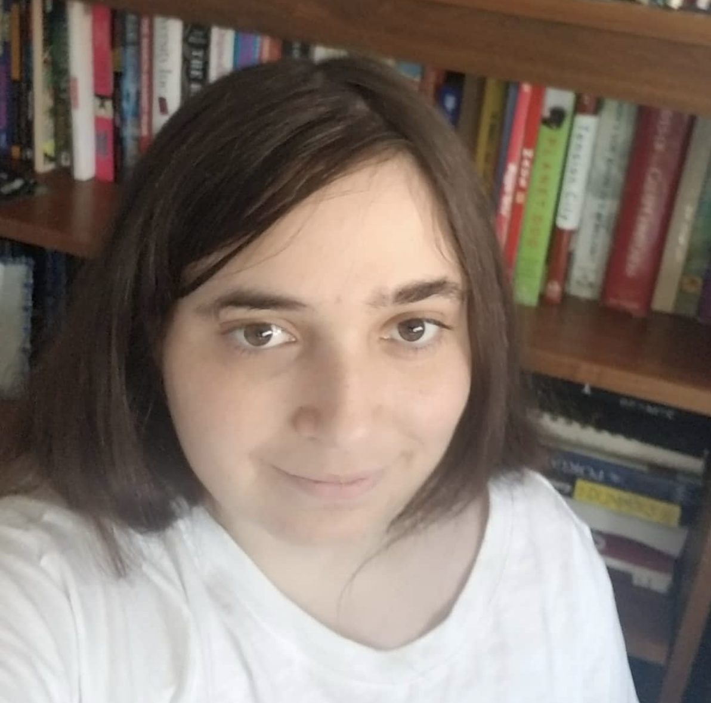

## About Me

**Julia Tanenbaum**

461 East Charleston Drive

Claremont, CA

julia.tanenbaum@gmail.com

(c) (909) 203-6541

**EDUCATION**

Masters in Library and Information Science, Concentration in Archives with a Graduate Certificate in Digital Humanities. Degree expected in June 2021

- University of California Los Angeles, Los Angeles, CA

Bachelor of Arts, _magna cum laude,_ with Honors in History, May 2017

- Bryn Mawr College, Bryn Mawr, PA

**EXPERIENCE**

**Community Archives Lab Intern** _,_ June L. Mazer Lesbian Archives,West Hollywood, CA August 2020-Present

- Completed a digital materials survey of the JD Di Salvatore collection, and cataloged the contents of over 100 hard drives from the 1990s-2000s to prepare the collection to be accessioned by UCLA.
- Planned and co-facilitated a monthly 25 person intergenerational LGBTQ consciousness raising group.
- Accessioned the papers and ephemera of actor Gina Young and created a finding aid for the collection, which includes physical and born digital materials.
- Led successful Giving Tuesday and end of the year fundraisers and increased Giving Tuesday contributions by 254% through data driven social media marketing and suggesting challenge grants to the board. Wrote email and social media copy, created graphics, and ran Facebook ads for the campaigns.
- Wrote a guide to fundraising with analytics tools and Facebook ads for future interns and the board and presented data and findings to the board for each campaign to improve future efforts.
- Created video and image based social media posts 2 times a week highlighting the collections on Instagram and Facebook and increased Facebook page likes by over 60%, Facebook reach by 2,600% and Instagram reach by 440%.
- Co-curated Scalar based exhibit on _Curve Magazine_ featuring documents and a Tableau based interactive map and data dashboard and timeline.js based interactive timeline.
- Implemented search engine optimization for the Mazer website and used Google Analytics to increase traffic.
- Processed subject files for digitization
- Conducted a survey of audiovisual materials before their transfer to the audiovisual preservation lab at UCLA

**Library Student Reference Assistant** _,_ UCLA Library,Los Angeles, CA September 2019-Present

- Provided research assistance on using online catalogs, databases, research strategies, and digital humanities tools to faculty and students in person and via email, Question Point chat, Lib Answers, and Zoom.
- Created 5 Research Guides in the humanities and Eastern European Area Studies.
- Hosted an English graduate seminar with 12 students and provided instruction on the use of special collections materials.
- Taught classes and workshops on information literacy skills and applications including Zotero and Zotfile.
- Edited and marked up Spanish, Maya, and English sociolinguistic interview transcripts for an international project.
- Served as library technical liaison for graduate student Omeka [website](https://bazlova.humspace.ucla.edu/) on _The History of Belarusian Vyzhivanka_. Set up server and taught the student how to exhibit artwork using Omeka.
- Designed, curated, and wrote copy for the digital [exhibit](https://spark.adobe.com/page/5gFJRQ3hXeYO5/)_Robot is 100!:_ _Karel Čapek&#39;s R.U.R and the Robot in Pop Culture_ in collaboration with the Czech consulate using Adobe Spark.
- Trained 3 library assistants and new hires on in person and digital reference services.

**Digital Library Assistant** UCLA LibraryLos Angeles, CA July 2020-December 2020

- Processed audio files by identifying and combining program segments in Audacity and create metadata for 2 collections of Cuban radio programs.
- Created social media posts 3 times a week highlighting digital collections on Instagram, Twitter, and Facebook and tracked analytics using Creator Studio.
- Created Dublin Core metadata, wrote copy, edited the writing of other students, and used Github to implement changes for the Wax based [exhibit](https://uclalibrary.github.io/lahousing/) Divided Development and the Struggle for Housing Justice in LA.
- Processed manuscript pages for IIIF compatibility.
- Participated in trainings covering version control with Github and Gitkracken, data cleaning with Open Refine, building static websites with Jekyl and Wax, and using tidy data principles in metadata work.

**Volunteer** South Asian American Digital Archive Los Angeles, CA April 2020-June 2020

- Edited and described 4 oral history interview transcriptions from the First Days Project

**Research Assistant to Professor Karin Stanford** , Northridge, CA October 2018- February 2020

- Conducted primary and secondary source research, copyediting, and revising for a project on the Civil Rights Movement in Los Angeles.
- Wrote grant proposal for NEH Media Development grant on a documentary about the Black Power movement in Los Angeles.

**Social Studies and English as a Second Language Tutor** Varsity Tutors,Claremont, CA January 2017 - October 2018

- Tutored students ranging from elementary to high school age in English, History, and English as a Second Language.
- Prepared lessons and homework to engage student interest and improve understanding of concepts.

**Data Management Analyst** IntegriChain, Philadelphia, PASeptember 2017 - December 2017

- Managed customer data from pharmaceutical companies and researched healthcare facilities for growing healthcare technology company.
- Provided digital customer service to clients to advise them on data management.
- Provided technical support to management by implementing quality controls to identify errors and validating existing data.

**Archives Student Worker,** Bryn Mawr College Special Collections, Bryn Mawr, PA, September 2015 - May 2017

- Catalogued and digitized primary source materials [photographs, manuscripts, ephemera] using Dublin Core metadata standards and CONTENTdm.
- Assisted student researchers, researchers from other institutions, and independent scholars by suggesting and locating materials.
- Located and shelved special collections materials.
- Collaborated with university archivist on collection development and outreach to student groups on campus.

**GRANTS**

- Department of Information Studies Digital Resources Development Initiative Grant (April 2020)

**PROJECTS**

[**Rebel Archives in the Golden Gulag**](http://rebelarchives.humspace.ucla.edu/)April-July 2020

- Built partnerships between the UCLA Department of Information Studies, the Freedom Archives, and 5 community organizations such as the California Coalition for Women Prisoners (CCWP) to curate a selection of their archival documents and obtain permissions to use them in exhibitions on the history of incarcerated people&#39;s organizing efforts in CA.
- Created Dublin Core metadata for 80 audio-visual and text based archival documents in Omeka.
- Conducted and transcribed an oral history interview with CCWP co-founder Mary Shields.

**PUBLICATIONS**

- [&quot;Striving Towards Solidarity in Abolitionist Research with Community Based Archives&quot;](https://laacollective.org/work/striving-towards-solidarity-in-abolitionst-research/)_Acid Free_, No. 12 (Winter 2020)
- (peer reviewed) [&quot;Personal/Political Epistemologies in Libraries and Archives&quot;](https://criticaltheoryis.blogspot.com/2020/02/personalpolitical-epistemologies.html)_Critical LIS Blog_ (February 2020)
- &quot;Never Again Para Nadie: The Jewish Movement to Shut Down I.C.E in Los Angeles&quot; _Salvo,_ No. 6(Summer 2019)
- (peer reviewed) &quot;To Destroy Domination in All Its Forms: Anarcha-Feminist Theory, Organization and Action 1970-1978.&quot; _Perspectives on Anarchist Theory: Anarcha-Feminisms_ 1, no. 29 (May 3, 2016)

**AWARDS**

- National Museum of African American History and Culture Robert Fredrick Smith Digital Archives Internship [awarded in 2020, postponed due to COVID-19]
- The Library and Information Studies Alumni Association Fellowship (2020)
- The Helen Taft Manning Essay Prize in History (2017)
- The Elizabeth Duane Gillespie Fund for Scholarship in American History (2016)

**PROFESSIONAL DEVELOPMENT**

**Young Research Library** 2019-2021

- Participated in workshops covering topics including primary source research with Trophy, critical cartography, mapping with Tableau and Open Street Map, and Network analysis with Gephi.
- Participated in 8 week Library Instruction Training as part of the Teaching and Learning Functional Team, covering topics including: values driven design; library instruction pedagogy; centering learners; systems, resources, and frameworks; prototyping and feedback; online instruction; and teaching writing classes.
- Participated in Library Carpentries workshops covering Unix and Python.

**Teaching Statement**

Groundbreaking feminist theorist bell hooks argues that &quot;To educate as the practice of freedom is a way of teaching that anyone can learn.&quot; The spirit of critical and feminist pedagogy motivates me to take up this challenge in the library classroom and encourage learners to participate in the learning process as their full and authentic selves. My experience working in community-based archives like the June L Mazer Lesbian Archives and facilitating both virtual classroom visits and consciousness-raising groups undergirds my commitment to building an empowering classroom community where students can question the power structures that structure information and scholarship and critically engage with the archives of difficult histories. My feminist approach to primary source literacy encourages learners to both understand and question practices of archival accessioning, representation, and access. First hand encounters with archival collections facilitate deep engagement with texts and their historical context. Ultimately, I attempt to work with learners so they develop confidence in their own voices and their ability to evaluate and question information sources. I hope such a learning community leaves them ready to question information and injustice in their daily lives.
